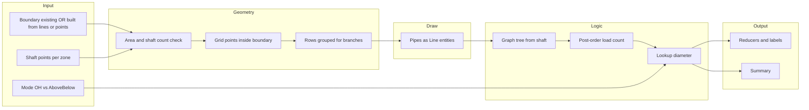

# Fire sprinkler AutoCAD plugin — implementation plan

## Goal (what ships)

End-to-end automation in **plan view** (all drawn pipes are horizontal distribution; the shaft is a **point** representing the vertical riser):

- Place sprinklers on a **grid** (max **3 m** between adjacent sprinklers; **~1.5 m** effective coverage radius so overlaps are sensible).
- Support **above false ceiling** and **below false ceiling** at the same XY (two symbols or layers per location).
- **Shaft capacity**: **~3000 m² per shaft** — compute **minimum shaft count** from selected boundary area; support **multi-zone** workflows (user places one point per zone, or later auto-split).
- **Routing topology**: **main run** leaves the shaft and runs across the zone; **branches** run **perpendicular** to that main in plan (words “vertical/horizontal” mean **plan directions only**).
- **Pipe sizing**: use your **lookup tables** (Ordinary Hazard vs **above+below** variant); size by **count of sprinklers downstream** on each segment.
- **Sizing direction**: **draw** from shaft outward, **compute** from **farthest sprinkler** back toward the shaft (tree accumulation on the graph).
- **Reducers** and **labels** (Ø mm) at diameter transitions.
- **Summary**: counts **above FS / below FS**, and **total pipe length by diameter**.

Out of scope for v1 unless you explicitly add later: hydraulic pressure/flow, looped grids, obstacle avoidance (walls/columns/beams), optimization of pipe length.

---

## Current codebase

- [autocad-final/Class1.cs](autocad-final/Class1.cs): `IExtensionApplication` only; shows a WinForms `MessageBox` on first `Idle` after NETLOAD.
- [autocad-final/autocad-final.csproj](autocad-final/autocad-final.csproj): AutoCAD trio + WinForms; no commands, no DB drawing yet.

**First structural step**: add `CommandMethod` entry points (e.g. `FIRELAYOUT` or smaller commands per phase), keep `IExtensionApplication` optional (splash can be removed or gated for production).

---

## First milestone: building boundary + area + table (build before sprinklers)

**Goal**: Everything below is done **inside the plugin**—no manual area calculation outside AutoCAD.

### Boundary input (two supported workflows)

1. **Existing area (if already drawn)**
  - User selects a **single closed boundary** representing the building footprint, e.g. **closed `Polyline`** (lightweight or 2D), or optionally `**Region**` / `**MPolygon**` if you want to support those.  
  - Plugin validates **closed** and **planar** (for polylines: `Closed` and suitable for area).  
  - This becomes the authoritative **building area** for downstream steps.
2. **No single polygon yet — construct from linework / points**
  - User selects **one or more** open or closed **Polylines** and/or `**Line`** segments and/or `**DBPoint`** / **points** (however you standardize picks).  
  - Plugin **builds one closed boundary** from the selection, e.g.:  
    - **Ordered chain**: connect segments in pick order or by **endpoint snapping** within tolerance into a single closed loop; or  
    - **Point loop**: user picks **vertices in order**, plugin creates a **closed `Polyline`**.
  - Edge cases to document in UI: self-intersections, gaps larger than tolerance, unclosed chain → show clear error and abort or offer “close last segment.”

### Area definition

- After the boundary is resolved (either selected or **created in the drawing** by the plugin as a new closed polyline), compute **area in drawing units squared**.  
- Store **numeric area** + **unit assumption** (meters vs millimeters via `INSUNITS` or a small settings dialog) so **3000 m² per shaft** and spacing rules stay consistent later.  
- Use AutoCAD APIs: `Polyline.Area` (or `Curve.GetArea()` patterns as appropriate for entity type).

### Clean table output

- Insert an `**AcDbTable`** (or equivalent **Table** entity) in model space (user-picked insertion point or default near boundary centroid).  
- Rows/columns example: **Label** | **Value** — e.g. “Building area” | `1234.56 m²` (format with reasonable precision).  
- Optional second row: **Required shafts (rule 3000 m²)** | `ceil(area/3000)` once units are trusted—can stay in same table as a preview or wait until shaft step is implemented.  
- Style: readable font height, border on, **one block of information** suitable for screenshots / client deliverables.

### Command shape (suggested)

- `**DEFINE_BUILDING_AREA`** (or sub-options inside one command):  
  - **Option A** — “Select existing closed boundary.”  
  - **Option B** — “Select entities to build boundary” → then run construction → optionally **add** the merged polyline to the drawing on a dedicated layer (e.g. `SPRK-BOUNDARY`) for traceability.

This milestone **proves** input flexibility + correct area + professional presentation **before** sprinkler grid work.

---

## Core data flow (how it actually runs)

**Invariant**: geometry is created first with **no sizes** (or provisional); **loads and diameters** are assigned after the graph exists. Do **not** size while drawing.

---

## Domain rules to encode (single source of truth)

| Rule                  | Implementation note                                                                                                                                                                 |
| --------------------- | ----------------------------------------------------------------------------------------------------------------------------------------------------------------------------------- |
| Max spacing 3 m       | After computing `cols`/`rows` from bounding box, set `spacingX = width/cols`, `spacingY = height/rows` so both ≤ 3 m; offset grid start by half-spacing from bbox for edge balance. |
| Coverage ~1.5 m       | Validation pass: flag cells where distance to boundary or to next sprinkler implies a gap (phase-2 polish).                                                                         |
| 3000 m² / shaft       | `requiredShafts = ceil(area / 3000)`; warn if user supplies fewer shaft points; optionally subdivide polygon for auto-zones (hard — defer).                                         |
| Two NFPA tables       | `PipeScheduleKind.OrdinaryHazard` vs `AboveAndBelowCeiling` — same API, different rows.                                                                                             |
| Tree + reverse sizing | Leaves = sprinklers (load 1); internal nodes sum children; each **pipe segment** stores **downstream sprinkler count** then `diameter = Lookup(count)`.                             |

---

## Engines (responsibilities)

### 1. Input and geometry engine

- **What**: Obtain one **closed** building boundary either by **selecting** an existing polygon/polyline/region **or** by **constructing** it from user-selected **polylines, lines, and/or points** (plugin merges into one loop). Compute **area**; optional **obstacles** later. Then read **shaft** point(s). Area must be **defined numerically** and **shown in a table** (see first milestone).
- **Why**: Wrong boundary/units breaks every downstream number; clients need a **clear, repeatable** area readout on the drawing.
- **How**: `Editor.GetSelection`/filters; validate `Polyline.Closed`; **boundary builder**: chain segments by endpoint proximity or ordered picks, create `Polyline` with `AddVertexAt`; `Polyline.Area` / curve area APIs; `Table` entity for output; `INSUNITS` or config for **m²** display and shaft rule.

### 2. Shaft / zone engine

- **What**: Compute `requiredShafts` from area; validate user-provided shaft count; associate each shaft with a **zone** (v1: **one boundary + N shaft points** inside — user responsible for logical zones, or run command **per room**).
- **Why**: Matches your “5000 m² → 2 shafts” rule.
- **How**: Simple: message + abort if `userShafts < requiredShafts`. Advanced later: Voronoi/partition.

### 3. Sprinkler placement engine

- **What**: Build **adjusted grid** inside boundary; **two entities per XY** for above/below FS (blocks on layers or block names).
- **Why**: Drives branch grouping and doubled table mode.
- **How**: Bbox → `cols`/`rows` with spacing ≤ 3 m → iterate centers → **point-in-polygon** test → optional edge fill for slivers. Group into **rows** (constant Y within tolerance) for branch alignment.

### 4. Routing engine (plan geometry)

- **What**: From shaft point, create **main trunk** (polyline or single segment), then **branch** segments along each row, then **drops** from branch to each sprinkler (short stubs).
- **Why**: Deterministic topology for the graph step.
- **How**: Fix an **orientation** per zone (e.g. main along longer bbox side or user pick two points for main direction). **Snap** branch lines to row polylines through sprinklers (sorted along main-perpendicular axis).

### 5. Network graph engine

- **What**: Convert drawn segments into a **tree**: root at **shaft**; edges are pipe segments; leaves are sprinklers.
- **Why**: Without this, load and reducers are guesswork.
- **How**: Build nodes at endpoints + sprinkler points; merge within tolerance; orient edges **away from root** via BFS from shaft. Store `PipeEdge { Start, End, SprinklerLoad }`.

### 6. Load engine (reverse semantics)

- **What**: Post-order: leaf = 1 sprinkler; propagate sums to root.
- **Why**: Implements “size from end of branch back to shaft.”
- **How**: Recursive or iterative post-order on tree; for **main** segments, cumulative sum of **whole branches** downstream along the main direction (as in your 10 + 12 + 14 example).

### 7. Sizing and reducer engine

- **What**: `diameter = TableLookup(load, scheduleKind)`; at each edge, compare parent/child diameter; insert **reducer block** or **dynamic block** at junction; attach **DBText** or **MText** labels.
- **Why**: Engineering-looking deliverable.
- **How**: Config class holding mm rows; optional JSON/config file later.

### 8. Summary engine

- **What**: Count `Above` vs `Below` blocks; sum **3D length** in plan is 2D length for horizontal net (drops can be nominal length constant if modeled); aggregate **length by diameter** from segment lengths after sizing.
- **Why**: BOQ / client report.

---

## Phased delivery (proof of action)

| Phase  | Deliverable                                                                                                                                      | Proves                                    |
| ------ | ------------------------------------------------------------------------------------------------------------------------------------------------ | ----------------------------------------- |
| **P0** | **Boundary**: existing closed polygon **or** built from polylines/points → **area** computed → `**AcDbTable`** (or equivalent) with area cleanly | Plugin-defined footprint + BOQ-ready area |
| **P1** | Extend: `requiredShafts` from area → user picks shaft(s) → place **grid points/blocks** (above+below) inside boundary                            | Placement + shaft rule                    |
| **P2** | Draw **main + branches + stubs** (no sizes, fixed layer/color)                                                                                   | Routing matches row/shaft topology        |
| **P3** | Build **graph** + **load** propagation                                                                                                           | Correct counts per segment                |
| **P4** | **Diameter** from tables + **labels** + **reducer** inserts                                                                                      | Looks like a design tool                  |
| **P5** | **Summary** (palette, CSV, or `MText` table) + polish (layers, undo, units)                                                                      | Client-ready output                       |

---

## First implementation steps (order of work)

1. **P0**: Command(s) for **boundary** — mode (existing vs construct-from-entities); **area** calculation; insert **Table** with area (and document unit handling). Add layer for plugin-created boundary polyline if built from fragments.
2. **P1**: `acdbmgd` transaction helpers; pick shaft, compute **requiredShafts**, write to command line and/or **extend same table** with a new row.
3. **Implement** `GridGenerator` + `PointInPolygon` + row grouping; insert **block references** (ship simple DWG blocks or use `POINT`/`CIRCLE` temporarily).
4. **Implement** routing with explicit **main direction** (angle from shaft or two clicks).
5. **Add** `NetworkBuilder` + `LoadCalculator` + `PipeSchedule` static tables.
6. **Wire** reducers/labels/summary.

---

## Key files to add (suggested layout)

- `Commands/FireLayoutCommands.cs` — `[CommandMethod]` entry points (include **P0** boundary + table).
- `Geometry/BoundaryService.cs` — **existing vs constructed** boundary, **area**, bbox, point-in-polygon.
- `Geometry/BoundaryBuilder.cs` (optional) — merge **lines/polylines/points** into one closed `Polyline`.
- `Reporting/AreaTableService.cs` (optional) — create/populate `**AcDbTable`** for area (and later shaft row).
- `Placement/SprinklerGrid.cs` — grid + rows.
- `Routing/PipeRouter.cs` — main/branch/stub polylines.
- `Network/PipeGraph.cs`, `Network/LoadCalculator.cs` — tree and loads.
- `Sizing/PipeSchedule.cs`, `Sizing/ReducerService.cs` — tables and symbols.
- `Reporting/SummaryReport.cs` — aggregates.

Keep tables and constants in **one** place for engineer review.

---

## Decisions to lock early

- **Drawing units = meters** (or conversion factor in config) — required for 3 m and 3000 m².
- **One shaft per command run** vs **multi-zone in one drawing** — v1 can be **one zone per command** to avoid ambiguous polygons.
- **Above+below**: schedule flag doubles conceptual sprinklers for sizing vs **two physical end nodes** — align with your table (typically **count each sprinkler location twice** for above+below mode when using the second table).

---

## Risks

- **Irregular boundaries**: grid trim leaves slivers — add **edge sprinklers** in a later iteration.
- **Graph from raw geometry**: endpoint tolerance must match drawing precision (use **ObjectId**-aware building from your own generated entities first to avoid ambiguity).
- **AMD64 vs AnyCPU**: consider **x64** platform to match AutoCAD and reduce reference warnings seen in builds.

